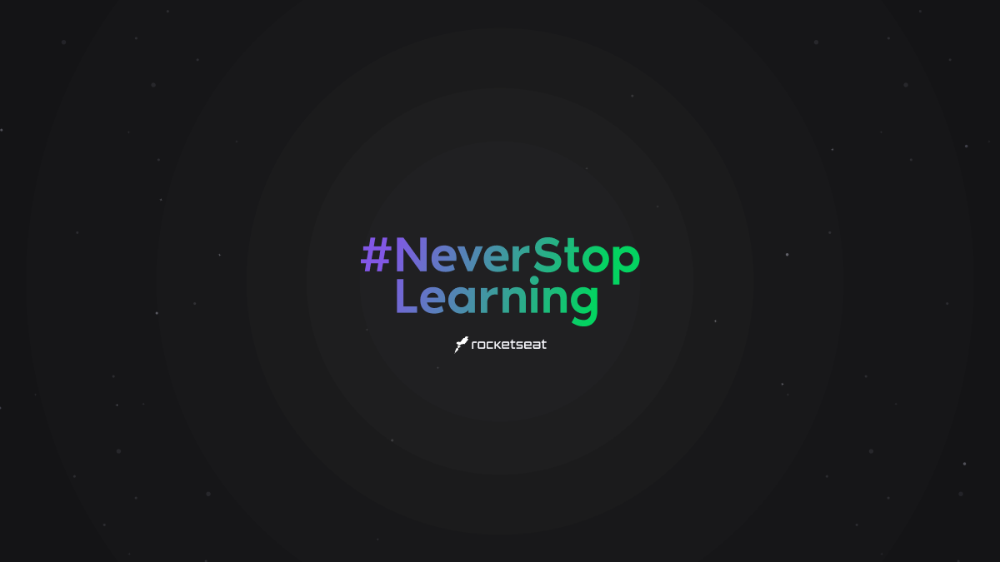

  

<h1 align="center">Rocketseat</h1>

  

  
  	
  

<h2>Sobre este projeto</h2>

Essa pasta de projetos foi criada para facilitar e concentrar todos os meus estudos referente a rocketseat em apenas um lugar, essa pasta ;).