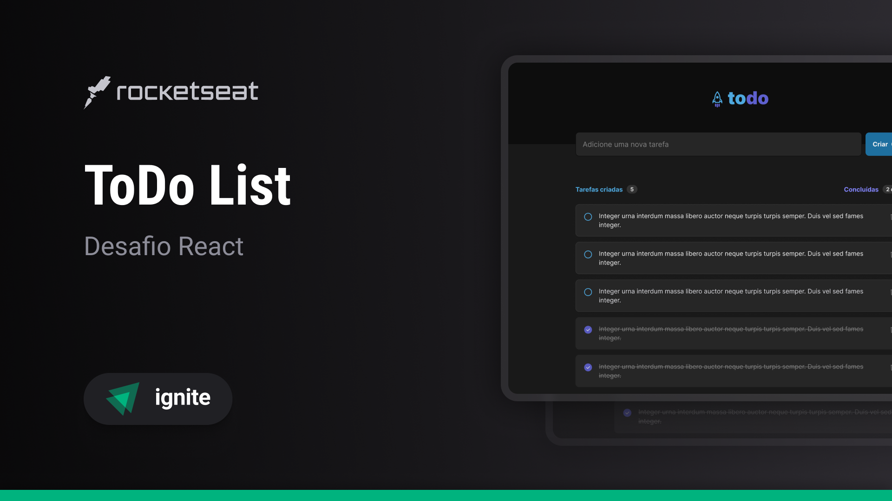
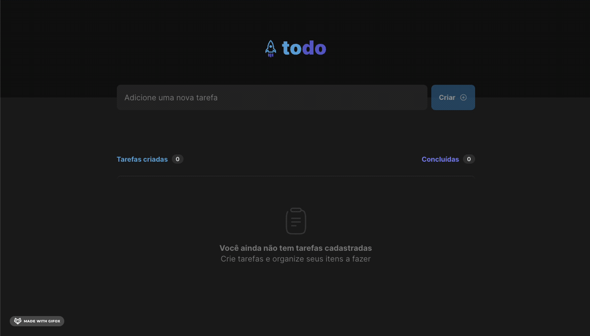
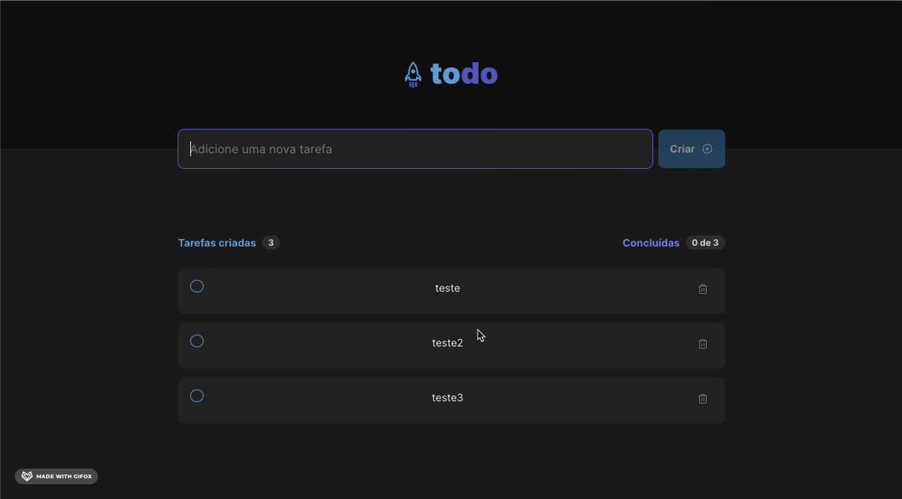
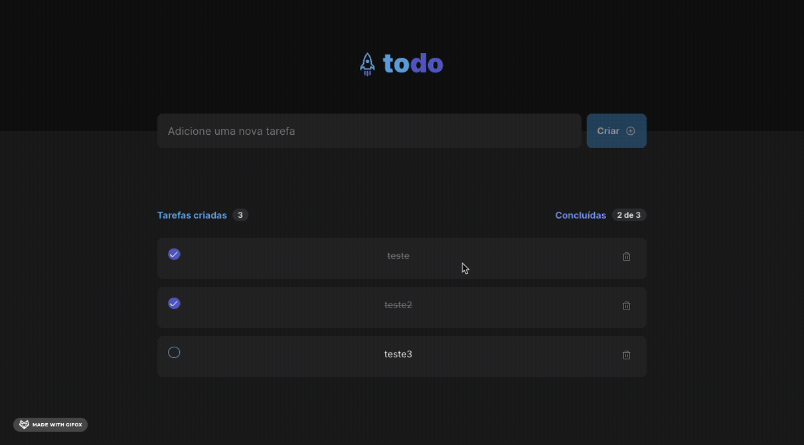
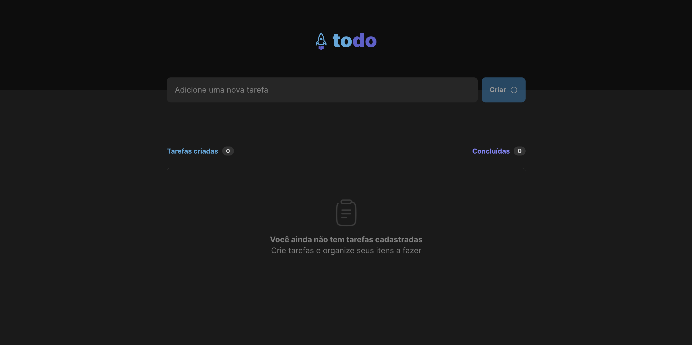
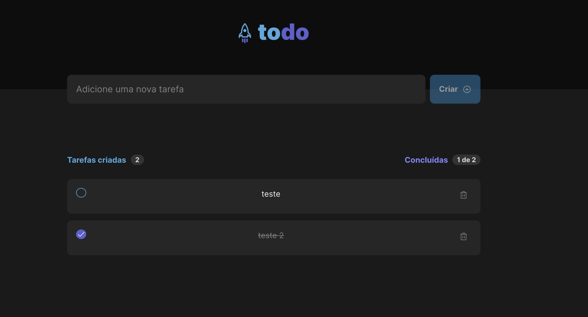
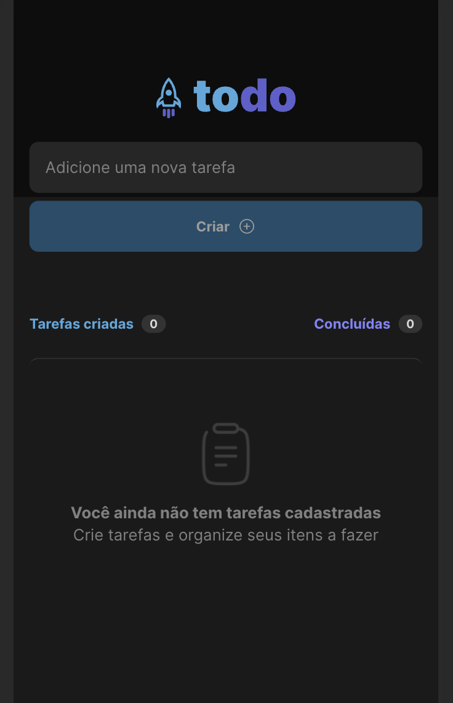
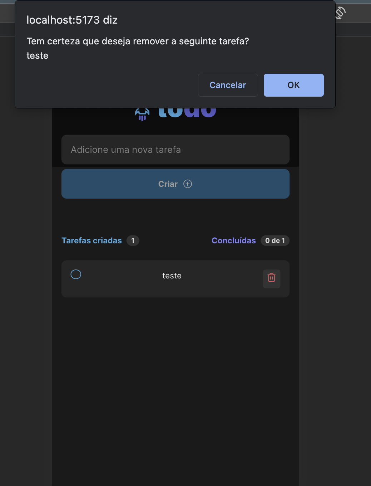
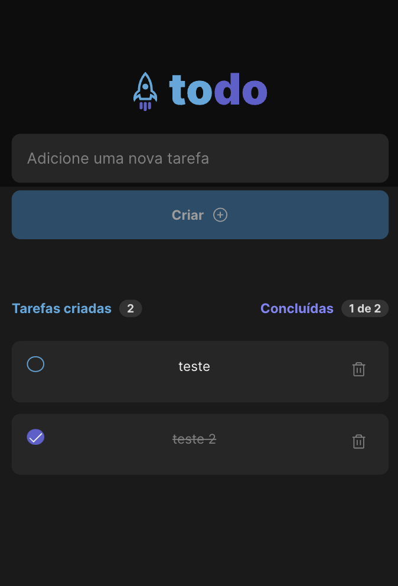

<div align="center">
  
</div>

<h1 align="center">Rocketseat - Ignite - ReactJS</h1>

<h2 align="center">Desafio: Praticando Conceitos</h2>

<div align="center">
  

  
  	
  <a href="https://github.com/vspirandeli/rocketseat/ignite/reactJS/2023/projeto01/desafio-praticando-conceitos/commits/master">
    
  </a>
</div>

<p align="center" style="margin-top: 1rem">
  

  
  
  
</p>

<h2>Sobre este projeto</h2>

Para esse desafio criei uma aplicação em [ReactJS](https://react.dev/) utilizando o [Vite](https://vitejs.dev/) e o superset [TypeScript](https://www.typescriptlang.org/).
Implementei responsividade, checagem de item duplicado, confirmação para remoção de item e um toasty retorno em tela.
Este projeto é uma aplicação de controle de tarefas no estilo **to-do list**, que contém as seguintes funcionalidades:

- Adicionar uma nova tarefa
- Marcar e desmarcar uma tarefa como concluída
- Remover uma tarefa da listagem
- Mostrar o progresso de conclusão das tarefas
  
Este projeto foi desenvolvido durante as aulas do [Ignite](https://www.rocketseat.com.br/formacao/react) para ReactJS da empresa [Rocketseat](https://www.rocketseat.com.br) sendo a resolução do desafio do módulo-1, com o intúito de ser uma app acessado via browser, ou seja, não foi desenvolvido uma versão mobile nativa, mas ele pode ser acessado via o browser do dispositivo mobile ou tablet.

<h2>Layout da aplicação</h2>

O layout pode ser acessado através desse [link](https://www.figma.com/file/0n0zDN7zbzhRbaEO74Xesx/ToDo-List/duplicate).

<h3>Aplicação em browser Desktop</h3>
<p align="center">
  

  
</p>

<h3>Aplicação em browser Mobile</h3>
<p align="center">
  

  
  
  
</p>

<h2>Desafio Rocketseat</h2>

A página com os detalhes do desafio podem ser acessados através desse [link](https://efficient-sloth-d85.notion.site/Desafio-01-Praticando-os-conceitos-do-ReactJS-91fd63dd1a5b4a2796152de293ec1074#ac9fbb05e79e4279b2c3df905b6ac1aa).

<h2>Tecnologias usadas no projeto</h2>

- [ReactJS](https://react.dev/).
- [ViteJS](https://vitejs.dev/).
- [Typescript](https://www.typescriptlang.org/).
- [React Toastify](https://github.com/fkhadra/react-toastify).

<h2>Como executar o projeto</h2>

Antes de mais nada você vai precisar ter em sua máquina, instalado, a ferramenta de versionamento de código: [Git](https://git-scm.com/book/en/v2/Getting-Started-Installing-Git).
Um editor de códigos: [VSCode](https://code.visualstudio.com/download).
O Runtime de javascript [NodeJS](https://nodejs.org/en).
E o gerenciador de pacotes [Yarn](https://yarnpkg.com/).

**Importante**: Os programas citados acima são os programas que eu utilizo, caso não concorde com alguma sugestão acima, sinta-se à vontade para utilizar qual quiser.

```bash
# Depois do projeto clonado em uma pasta no seu computador.
$ cd desafio-praticando-conceitos

# Instale as dependências do projeto.
$ yarn

# Após instalado execute o projeto.
$ yarn dev

# Se não for alterada a porta você pode acessar esse projeto pelo link: http://localhost:5173/
```

<h4>Desenvolvido por Victor Spirandeli.</h4>

- [LinkedIn](www.linkedin.com/in/victor-hugo-spirandeli-8a188183).
- [E-mail](mailto:vspirandeli@gmail.com).

<!-- # React + TypeScript + Vite

This template provides a minimal setup to get React working in Vite with HMR and some ESLint rules.

Currently, two official plugins are available:

- [@vitejs/plugin-react](https://github.com/vitejs/vite-plugin-react/blob/main/packages/plugin-react/README.md) uses [Babel](https://babeljs.io/) for Fast Refresh
- [@vitejs/plugin-react-swc](https://github.com/vitejs/vite-plugin-react-swc) uses [SWC](https://swc.rs/) for Fast Refresh

## Expanding the ESLint configuration

If you are developing a production application, we recommend updating the configuration to enable type aware lint rules:

- Configure the top-level `parserOptions` property like this:

```js
export default {
  // other rules...
  parserOptions: {
    ecmaVersion: 'latest',
    sourceType: 'module',
    project: ['./tsconfig.json', './tsconfig.node.json'],
    tsconfigRootDir: __dirname,
  },
}
```

- Replace `plugin:@typescript-eslint/recommended` to `plugin:@typescript-eslint/recommended-type-checked` or `plugin:@typescript-eslint/strict-type-checked`
- Optionally add `plugin:@typescript-eslint/stylistic-type-checked`
- Install [eslint-plugin-react](https://github.com/jsx-eslint/eslint-plugin-react) and add `plugin:react/recommended` & `plugin:react/jsx-runtime` to the `extends` list -->
